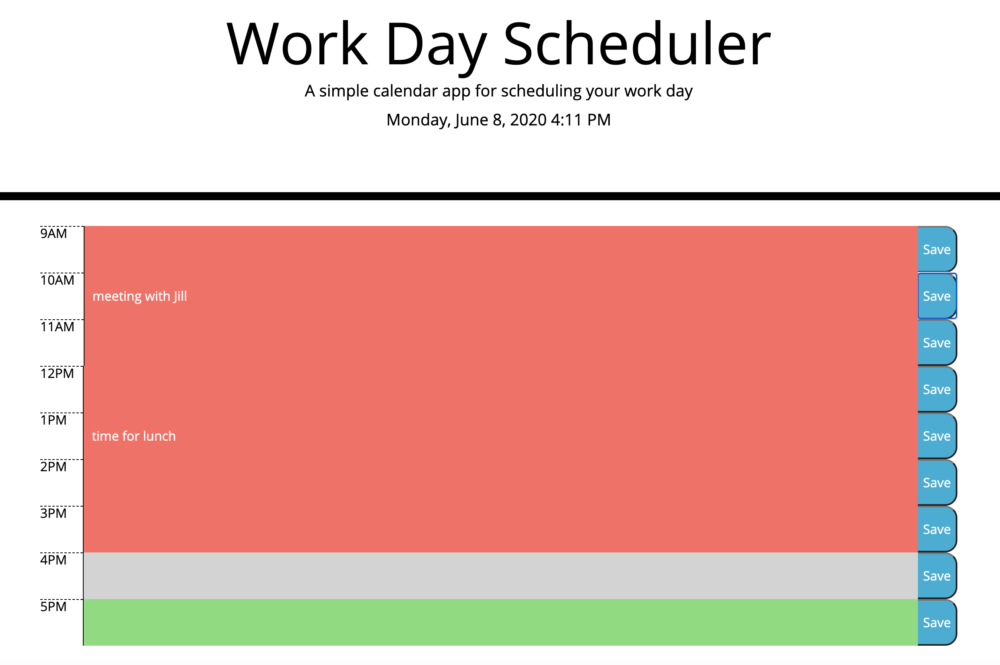

# Day-Planner

A simple calendar application that allows user to save events for each hour of the work day. The current day and time is displayed at top of calendar. Also, each hour is color coded to reflect if the time slot is past, present, or future.

## Test it out [here](https://rosebourn.github.io/Day-Planner/)

Click on time slot you would like to add an event to. Add event and click save.

## Technologies

- HTML
- CSS
- JavaScript
- jQuery
- Bootstrap
- Moment.js

